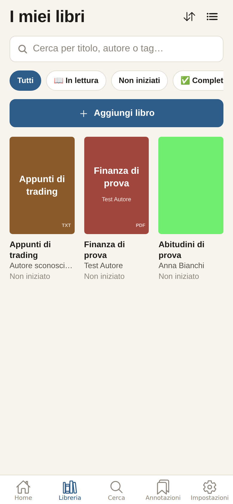
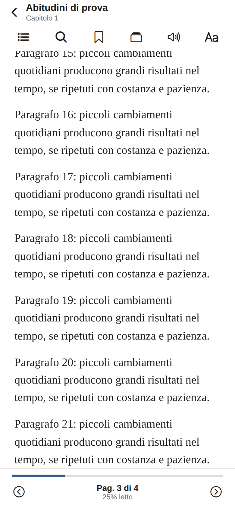
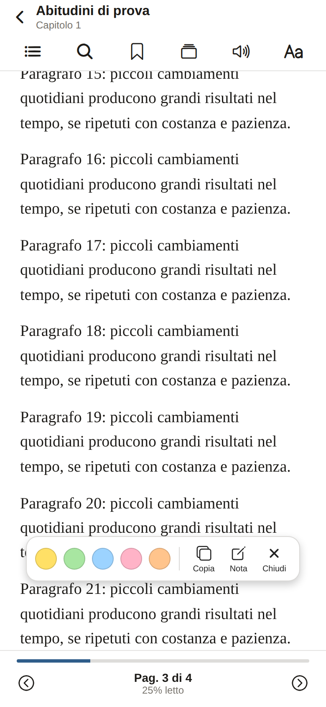
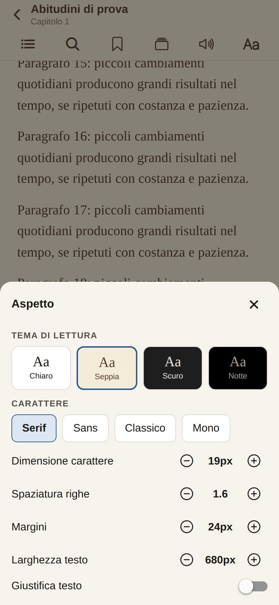
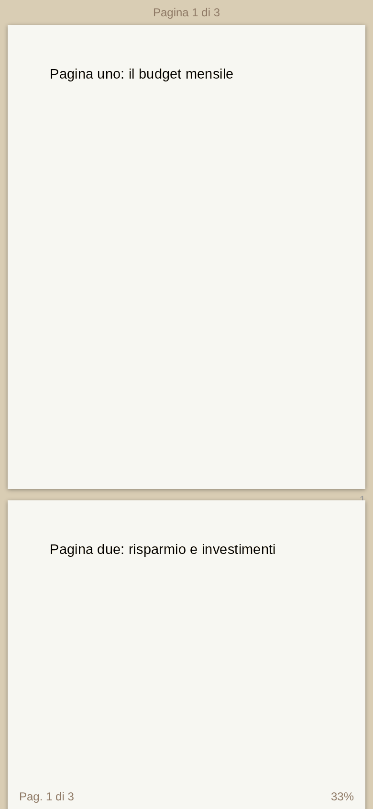
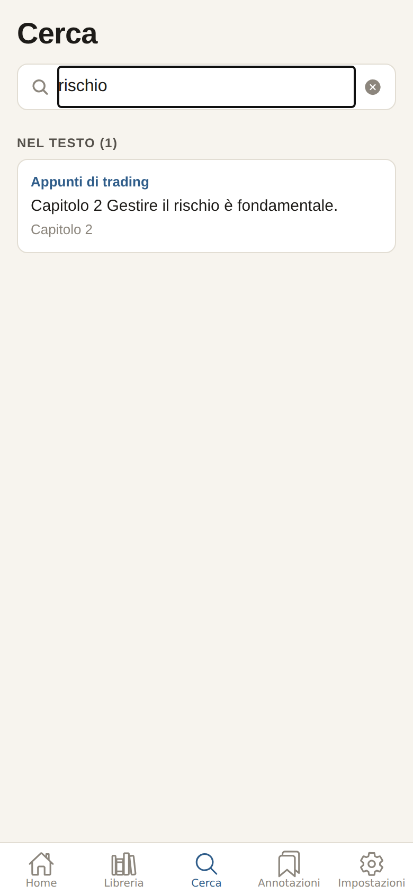
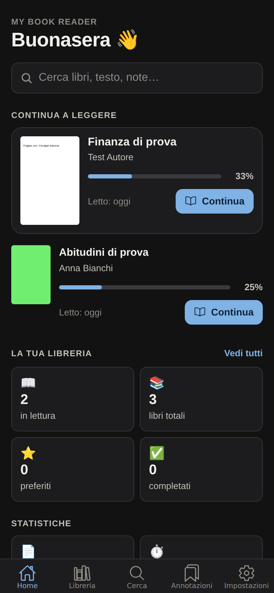

# 📚 My Book Reader

App personale per **caricare, organizzare e leggere i tuoi libri digitali** (EPUB, PDF, TXT).
Funziona completamente **offline**: i libri, le note e le evidenziazioni restano solo sul tuo dispositivo.

Costruita con **React Native + Expo (SDK 57) + TypeScript**, gira su **iPhone, Android e Web** con lo stesso codice.

| Home | Libreria | Lettore EPUB | Evidenziazioni |
| --- | --- | --- | --- |
|  |  |  |  |

| Aspetto (Seppia) | Lettore PDF | Ricerca | Tema scuro |
| --- | --- | --- | --- |
|  |  |  |  |

> Gli screenshot mostrano libri di prova generati automaticamente dai test (nessun contenuto protetto).

---

## ✨ Funzionalità

**Importazione**
- Pulsante **＋ Aggiungi libro**: scegli uno o più file da iPhone, iCloud Drive, Google Drive, …
- Riconoscimento del formato dal contenuto del file, validazione, rilevamento duplicati
- Estrazione automatica di titolo, autore, copertina, lingua, numero di capitoli/pagine
- Se mancano i metadati si apre subito la scheda per **modificarli a mano**
- I libri protetti da **DRM vengono rifiutati** (l'app non aggira protezioni anticopia)

**Libreria**
- "I miei libri" in **griglia** o **lista**, con copertina, titolo, autore, % di completamento, ultima lettura e pulsante **Continua**
- Ricerca, filtri (In lettura, Non iniziati, Completati, ⭐ Preferiti), **categorie personalizzate**, **tag**, ordinamento
- Stato di lettura: Non iniziato · In lettura · Completato

**Lettore EPUB / TXT**
- Pagine con swipe o tocco ai lati, indice/capitoli, ricerca nel testo, percentuale di avanzamento
- 🔖 Segnalibri, 🖍️ evidenziazioni in 5 colori, 📝 note (anche sul passaggio selezionato), copia testo
- Temi **Chiaro, Seppia, Scuro, Notte**; font, dimensione, interlinea, margini, larghezza testo, giustificazione
- Schermo intero (tocca al centro per mostrare/nascondere i comandi)
- **Posizione salvata automaticamente**, anche cambiando dimensione del carattere

**Lettore PDF**
- Zoom con pulsanti e **pinch-to-zoom**, pagina precedente/successiva, numero di pagina
- Ricerca nel testo, segnalibri, note sulla pagina, filtri notte/seppia
- Copertina generata automaticamente dalla prima pagina; posizione salvata automaticamente

**Altro**
- 🔍 **Ricerca globale** su titoli, autori, testo dei libri, note ed evidenziazioni
- 📊 **Dashboard**: continua a leggere, libri in lettura/totali/preferiti/completati, pagine lette, tempo di lettura, giorni consecutivi
- 🔊 **Leggi ad alta voce** (voci native iOS/Android): ▶ Play · ⏸ Pausa · ⏹ Stop · ⏪ -15 s · ⏩ +15 s
- 🌙 Modalità chiara/scura dell'app (anche automatica)
- ✈️ **Offline**: nessuna connessione necessaria per aprire e leggere i libri

---

## 🚀 Avvio rapido

### Requisiti

- [Node.js](https://nodejs.org) **20 o superiore** (consigliato 22 LTS)
- Git
- Sul telefono: l'app **Expo Go** ([App Store](https://apps.apple.com/app/expo-go/id982107779) · [Google Play](https://play.google.com/store/apps/details?id=host.exp.exponent))

### Installazione

```bash
git clone https://github.com/mel0mac86/lettura.git my-book-reader
cd my-book-reader
npm install
```

`npm install` genera anche automaticamente il bundle offline di pdf.js (`services/pdf/generated/`).

### Configurazione

Nessuna configurazione è necessaria per la V1. Il file `.env.example` elenca le variabili **facoltative**
per le versioni future (Supabase, backend AI):

```bash
cp .env.example .env   # opzionale
```

### Avvio

```bash
npx expo start
```

Si apre il pannello di Expo con un **QR code**. Premi `i` per il simulatore iOS (solo Mac con Xcode),
`a` per l'emulatore Android, `w` per il browser.

---

## 📱 Avviare l'app su iPhone — istruzioni esatte

### Metodo 1 — Expo Go (il più semplice, gratis, nessun account Apple)

1. Sull'iPhone installa **Expo Go** dall'App Store (deve essere aggiornato: supporta l'SDK 57 usato dal progetto).
2. Collega **computer e iPhone alla stessa rete Wi-Fi**.
3. Sul computer, nella cartella del progetto:
   ```bash
   npm install
   npx expo start
   ```
4. Apri l'app **Fotocamera** dell'iPhone e inquadra il **QR code** mostrato nel terminale.
5. Tocca il banner **"Apri in Expo Go"**: l'app viene compilata e si apre (la prima volta serve circa un minuto).
6. Tocca **＋ Aggiungi libro** e scegli un file EPUB, PDF o TXT dall'app **File** (anche da iCloud Drive).

Se l'iPhone non si collega (reti aziendali, hotspot, VPN, firewall):

```bash
npx expo start --tunnel
```

e inquadra di nuovo il QR code. Se lo chiede, conferma l'installazione di `@expo/ngrok`.

> ℹ️ Con Expo Go l'app funziona finché il computer esegue `npx expo start`; i libri importati
> restano comunque salvati nello spazio di Expo Go sull'iPhone.

### Metodo 2 — App installata sull'iPhone (build con EAS)

Per avere l'icona "My Book Reader" sull'iPhone, indipendente dal computer:

1. Serve un account **Apple Developer** (a pagamento) e un account gratuito [Expo](https://expo.dev/signup).
2. ```bash
   npx eas-cli@latest login
   npx eas-cli@latest device:create        # registra il tuo iPhone (apri il link sul telefono)
   npx eas-cli@latest build --platform ios --profile preview
   ```
3. Al termine della build apri sull'iPhone il link/QR code fornito da EAS e installa l'app.
4. Su iOS 16+ attiva **Impostazioni → Privacy e sicurezza → Modalità sviluppatore** se richiesto.

### Metodo 3 — Simulatore iOS o iPhone via cavo (Mac con Xcode)

```bash
npx expo run:ios            # simulatore
npx expo run:ios --device   # iPhone collegato via USB
```

---

## 🧪 Test e qualità

```bash
npm test            # 60 test automatici (Jest)
npm run lint        # ESLint
npm run typecheck   # TypeScript strict
npm run check       # tutti e tre
```

I test coprono: importazione libri (EPUB/PDF/TXT, duplicati, DRM, formati non supportati), rilevamento formato,
creazione nel database, salvataggio e caricamento della posizione, segnalibri, evidenziazioni, note, ricerca,
percentuale di avanzamento, categorie/tag/filtri, statistiche, TXT, TTS, RAG e componenti UI.
Usano un vero SQLite (sql.js/WebAssembly) e libri di prova **generati al volo**.

---

## 🗂️ Struttura del progetto

```
my-book-reader/
├── app/                        # Schermate (Expo Router)
│   ├── _layout.tsx             # Provider: database, impostazioni, tema
│   ├── (tabs)/
│   │   ├── index.tsx           # Home / dashboard
│   │   ├── library.tsx         # I miei libri
│   │   ├── search.tsx          # Ricerca globale
│   │   ├── bookmarks.tsx       # Segnalibri, evidenziazioni, note
│   │   └── settings.tsx        # Impostazioni
│   ├── reader/[id].tsx         # Lettore (EPUB/TXT/PDF)
│   ├── book/[id].tsx           # Scheda libro e modifica metadati
│   └── categories.tsx          # Gestione categorie
├── components/                 # BookCard, BookGrid, SearchBar, ProgressBar, ReaderControls, …
│   ├── reader/                 # ReflowReader, PdfReader, WebView bridge, pannelli del lettore
│   └── ui/                     # Componenti base (Button, Sheet, EmptyState, ErrorState, …)
├── services/
│   ├── books/                  # Importazione, formati, repository libri
│   ├── epub/  txt/  pdf/       # Parser e visualizzatori per formato
│   ├── reader/                 # Pagina HTML del lettore, protocollo RN ↔ WebView
│   ├── annotations/            # Segnalibri, evidenziazioni, note
│   ├── search/  categories/  settings/  stats/
│   ├── storage/                # File system (iOS/Android) e IndexedDB (web)
│   ├── database/               # Adattatore SQLite
│   ├── tts/                    # Lettura ad alta voce
│   ├── ai/                     # Architettura RAG (V4)
│   └── sync/  auth/            # Predisposizione Supabase (V2)
├── database/                   # Schema e migrazioni
├── hooks/  providers/  types/  utils/  constants/
├── tests/                      # Test automatici
├── docs/                       # Architettura, AI, roadmap, screenshot
└── scripts/                    # Generazione bundle pdf.js offline
```

Dettagli in [docs/ARCHITECTURE.md](docs/ARCHITECTURE.md).

---

## 🛠️ Tecnologie

| Area | Scelta |
| --- | --- |
| App | React Native 0.86, Expo SDK 57, Expo Router, TypeScript strict |
| Database | SQLite locale con `expo-sqlite` (migrazioni versionate) |
| File | `expo-file-system` (iOS/Android), IndexedDB (web) |
| EPUB | Parser proprio in JS (`jszip` + `fast-xml-parser`) + impaginazione CSS in `react-native-webview` |
| PDF | `pdf.js` incorporato nell'app, eseguito offline in WebView |
| TTS | `expo-speech` (voci native) |
| Test | Jest (`jest-expo`), `sql.js`, Testing Library |

Tutte le librerie sono **compatibili con Expo Go**: non serve una build nativa per provare l'app.

---

## 🔒 Privacy e sicurezza

- I libri e i dati personali sono salvati **solo nello spazio privato dell'app** sul dispositivo.
- **Nessun file viene inviato a server esterni**; l'app non esegue richieste di rete durante la lettura.
- Il contenuto dei libri viene sanificato prima della visualizzazione (niente script) e la WebView non può navigare altrove.
- **Nessun sistema di rimozione DRM**: i libri protetti vengono rifiutati con un messaggio chiaro.
- Il repository contiene **solo codice**: nessun libro protetto da copyright e nessun `.env` reale.

---

## 🗺️ Roadmap

- **V1** ✅ EPUB, PDF, TXT, libreria, lettore, ricerca, segnalibri, note, evidenziazioni, progresso, dark mode, offline
- **V2** account, sincronizzazione cloud (Supabase), backup, sincronizzazione di posizione e note
- **V3** Text-to-Speech avanzato, statistiche avanzate, traduzione, dizionario, nuovi formati (CBZ, MOBI senza DRM)
- **V4** assistente AI sul libro con RAG: riassunti, spiegazioni, domande con citazioni, flashcard, quiz, mappe concettuali

Vedi [docs/ROADMAP.md](docs/ROADMAP.md) e [docs/AI_ARCHITECTURE.md](docs/AI_ARCHITECTURE.md).

---

## 🤝 Contribuire

Leggi [CONTRIBUTING.md](CONTRIBUTING.md). Le modifiche sono elencate in [CHANGELOG.md](CHANGELOG.md).

## 📄 Licenza

[MIT](LICENSE). Il lettore PDF include pdf.js di Mozilla (Apache 2.0).
